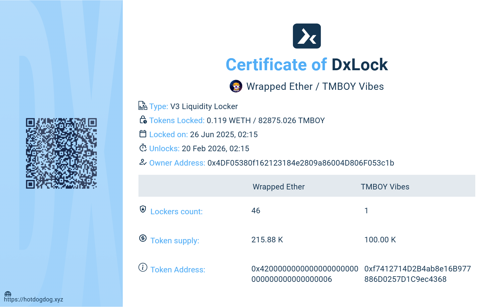

# 🧢 TMBOY Vibes

**$TMBOY** is a playful meme token inspired by the Tomboy culture — celebrating the charm, energy, and meme supremacy of tomboy girls.

---

## 🔍 Description

**$TMBOY** represents:
- 💬 A lighthearted community with tomboy-themed memes and vibes.
- 🧢 Tomboy GF Energy, Tomboy Supremacy, and the irresistible tomboy crushes.
- 🎮 Fun and casual DeFi engagement with optional burning events announced in Telegram.

---
## 📊 Token Stats (as of July 2025)

- **Max Total Supply:** 100,000 TMBOY
- **Holders:** 46,347
- **Total Transfers:** 47,015

## 🗺 Roadmap & Key Milestones

### ✅ Current Stage
- 🚀 Token deployed and trading open.
- 🎨 Community-driven meme creation begins.

### 📅 Coming Soon
- 🔥 Voluntary token burning events announced in the Telegram channel.
- 🫂 Community building and growth on Telegram.
- 🎭 Meme contests and user-generated content with tomboy culture.
- 🗣 Collaboration with other meme coin projects.
- 📢 Listing updates and social growth tracking on GeckoTerminal and more.

---

## 🎯 Cultural Vibes

**TMBOY Vibes** is all about:
- 🧢 Caps, oversized shirts, sneakers — but with a playful smile.
- 💥 Meme lines like "Tomboy GF Energy", "Tomboy Supremacy", "Buy The Tomboy", and "She’s Not Your Boy".
- 💫 Drake meme template: Reject girly heels ✅ Accept tomboy caps ✅
- 💕 Community motto: "She’s just one of the boys… but not really."

---

## 🔗 Official Resources
- 🐦 **Twitter**: [DeFiPoolClub on X](https://x.com/DeFiPoolClub)
- 📄 **Contract**: [`0xf7412714d2b4ab8e16b977886d0257d1c9ec4368`](https://basescan.org/token/0xf7412714d2b4ab8e16b977886d0257d1c9ec4368)
- 📊 **Liquidity Pool**: [GeckoTerminal Pool](https://www.geckoterminal.com/base/pools/0x55c6288b598610be51dd9165620b1b552fb45b5f)
- 🗞 **News**: [Telegram Channel](https://t.me/tmboyvibes)
- 💬 **Community Chat**: [Telegram Group](https://t.me/tmboychat)
- 💻 **GitHub**: [github.com/botsradar/tmboy](https://github.com/botsradar/tmboy)
- 🎥 **YouTube**: [Watch on YouTube](https://youtube.com/shorts/rivyRn31t5Y?si=CsnrLMnkt3NpvbZt)
- 🌐 **Website**: 🇺🇸 [English](https://bot.defipool.club/en/token_tmboy_vibes.html)
- 📄 **Whitepaper**: [View Whitepaper](https://github.com/botsradar/tmboy/blob/main/whitepaper.pdf)
- 🕹 **Discord**: [Join Discord Community](https://discord.gg/6ps9WmC7xt)
---
---

## 🌏 Multilingual Website

Explore the official TMBOY Vibes pages in your language!

- 🇷🇺 [Русский](https://bot.defipool.club/ru/token_tmboy_vibes.html)
- 🇺🇸 [English](https://bot.defipool.club/en/token_tmboy_vibes.html)
- 🇮🇳 [हिन्दी](https://bot.defipool.club/hi/token_tmboy_vibes.html)
- 🇮🇷 [فارسی](https://bot.defipool.club/fa/token_tmboy_vibes.html)
- 🇵🇹 [Português](https://bot.defipool.club/pt/token_tmboy_vibes.html)
- 🇺🇦 [Українська](https://bot.defipool.club/uk/token_tmboy_vibes.html)
- 🇹🇷 [Türkçe](https://bot.defipool.club/tr/token_tmboy_vibes.html)
- 🇺🇿 [O‘zbek](https://bot.defipool.club/uz/token_tmboy_vibes.html)
- 🇻🇳 [Tiếng Việt](https://bot.defipool.club/vi/token_tmboy_vibes.html)
- 🇦🇪 [العربية](https://bot.defipool.club/ar/token_tmboy_vibes.html)
- 🇮🇩 [Bahasa Indonesia](https://bot.defipool.club/id/token_tmboy_vibes.html)
- 🇪🇸 [Español](https://bot.defipool.club/es/token_tmboy_vibes.html)
- 🇩🇪 [Deutsch](https://bot.defipool.club/de/token_tmboy_vibes.html)
- 🇮🇹 [Italiano](https://bot.defipool.club/it/token_tmboy_vibes.html)
- 🇫🇷 [Français](https://bot.defipool.club/fr/token_tmboy_vibes.html)
- 🇹🇭 [ไทย](https://bot.defipool.club/th/token_tmboy_vibes.html)

Find the language selector on the site footer for all available translations.

---

## 🔐 Liquidity Lock Certificate

The liquidity for **TMBOY Vibes** is securely locked via **DxLock V3 Liquidity Locker** until **February 20, 2026**.

- 🔗 [View Certificate on DxLock](https://www.dx.app/dxlock/view/liquidity-locker-v3?address=0x2ad66e5329826aaf65da0bf2a48094de2b3474ed&chain=8453)
- 🧾 Certificate: 

**Summary:**
- **Locked Tokens:** 0.119 WETH / 82,875.026 TMBOY
- **Lock Duration:** June 26, 2025 – February 20, 2026
- **Owner Address:** [`0x4DF0...3c1b`](https://basescan.org/address/0x4DF05380f162123184e2809a86004D806F053c1b) (ownership renounced)
- Ownership of the token contract has been renounced. No one has control over contract settings or the locked liquidity.
- This means that no party can alter the contract or withdraw the locked liquidity early, ensuring safety for all holders.
- **Locker Address:** [`0x2ad6...74ed`](https://www.dx.app/dxlock/view/liquidity-locker-v3?address=0x2ad66e5329826aaf65da0bf2a48094de2b3474ed&chain=8453)

> ✅ Liquidity locked and publicly verifiable on Base network via DxLock.

> ⚡️ This is a community-driven meme token. No promises, no roadblocks, just pure tomboy vibes. Join us, meme with us, vibe with us.

---

## 📜 License

This project is licensed under the MIT License. See [LICENSE](./LICENSE) for more details.
