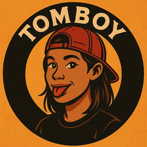

# 🧢 TMBOY Vibes

**$TMBOY** is a playful meme token inspired by the Tomboy culture — celebrating the charm, energy, and meme supremacy of tomboy girls.

---

## 🔍 Description

**$TMBOY** represents:
- 💬 A lighthearted community with tomboy-themed memes and vibes.
- 🧢 Tomboy GF Energy, Tomboy Supremacy, and the irresistible tomboy crushes.
- 🎮 Fun and casual DeFi engagement with optional burning events announced in Telegram.

---

## 🗺 Roadmap & Key Milestones

### ✅ Current Stage
- 🚀 Token deployed and trading open.
- 🎨 Community-driven meme creation begins.

### 📅 Coming Soon
- 🔥 Voluntary token burning events announced in the Telegram channel.
- 🫂 Community building and growth on Telegram.
- 🎭 Meme contests and user-generated content with tomboy culture.
- 🗣 Collaboration with other meme coin projects.
- 📢 Listing updates and social growth tracking on GeckoTerminal and more.

---

## 🎯 Cultural Vibes

**TMBOY Vibes** is all about:
- 🧢 Caps, oversized shirts, sneakers — but with a playful smile.
- 💥 Meme lines like "Tomboy GF Energy", "Tomboy Supremacy", "Buy The Tomboy", and "She’s Not Your Boy".
- 💫 Drake meme template: Reject girly heels ✅ Accept tomboy caps ✅
- 💕 Community motto: "She’s just one of the boys… but not really."

---

## 🔗 Official Resources

- 📄 **Contract**: [`0xf7412714d2b4ab8e16b977886d0257d1c9ec4368`](https://basescan.org/token/0xf7412714d2b4ab8e16b977886d0257d1c9ec4368)
- 🗞 **News**: [Telegram Channel](https://t.me/tmboyvibes)
- 💬 **Community Chat**: [Telegram Group](https://t.me/tmboychat)
- 💻 **GitHub**: [github.com/botsradar/tmboy](https://github.com/botsradar/tmboy)

---

> ⚡️ This is a community-driven meme token. No promises, no roadblocks, just pure tomboy vibes. Join us, meme with us, vibe with us.

---

## 📜 License

This project is licensed under the MIT License. See [LICENSE](./LICENSE) for more details.
